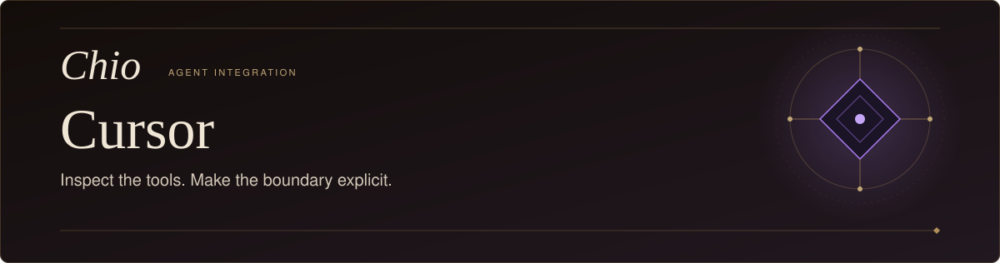
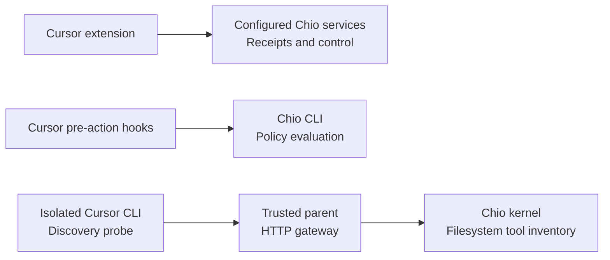

<p align="center">
  <picture>
    <source media="(max-width: 600px)" srcset="docs/assets/readme-hero-mobile.svg" />
    
  </picture>
</p>

<p align="center">
  <a href="LICENSE"></a>
  
</p>

<p align="center">
  <strong>Put policy and receipts in your editor.</strong>
</p>

<p align="center">
  <a href="#install-from-source">Install</a>&nbsp;&nbsp;&middot;&nbsp;&nbsp;
  <a href="#in-cursor">In Cursor</a>&nbsp;&nbsp;&middot;&nbsp;&nbsp;
  <a href="#kernel-discovery">Kernel discovery</a>&nbsp;&nbsp;&middot;&nbsp;&nbsp;
  <a href="#architecture">Architecture</a>&nbsp;&nbsp;&middot;&nbsp;&nbsp;
  <a href="#development">Development</a>&nbsp;&nbsp;&middot;&nbsp;&nbsp;
  <a href="#documentation">Documentation</a>
</p>

---

Chio for Cursor brings [Chio](https://github.com/backbay-labs/chio) workspace
setup, pre-action policy checks and receipt inspection into the editor. Review
your guard configuration, inspect receipts from your Chio deployment and export
evidence through the command palette. A separate macOS launcher provides
isolated discovery of four filesystem tools through a Chio kernel gateway.

> **Current scope:** The extension and discovery launcher are integration
> candidates. Protected model execution is deliberately disabled: `--prompt`
> refuses before Cursor starts. Prevention of unsupported server-owned actions
> remains unverified. See the [acceptance record](docs/acceptance-20260909.md).

## Install from source

Use Node.js 22 or newer, npm, and Cursor with its `cursor` shell command installed.
The repository includes its pinned bridge dependency under `vendor/`; no private
sibling checkout is required.

```sh
git clone https://github.com/backbay-labs/chio-cursor-plugin.git
cd chio-cursor-plugin
npm ci --ignore-scripts --no-audit --no-fund
npm run package
```

Packaging builds the extension and hook bundles, then writes
`artifacts/chio-cursor-0.3.0.vsix` and its SHA256 file. Install that VSIX into an
isolated preview profile, replacing the two directory placeholders below:

```sh
cursor \
  --user-data-dir /absolute/disposable/cursor-data \
  --extensions-dir /absolute/disposable/cursor-extensions \
  --install-extension ./artifacts/chio-cursor-0.3.0.vsix
```

Use those same profile arguments when opening Cursor. Before opening a disposable
workspace, set `chio.bond` to `manual` in that profile's settings so you choose
when to connect it to Chio. The [operations guide](OPERATIONS.md) covers profile
setup, upgrades, recovery and removal.

## In Cursor

Open the command palette and search for **Chio**. Start with **Initialize
workspace**, then **Open policy.yaml** and **Show guard pipeline**.
Initialization creates a policy when one is absent, copies four self-contained
hook bundles into `.chio/hooks/`, and registers them in `.cursor/hooks.json`.
It preserves other providers' hooks and backs up existing hook configuration
before an upgrade. Malformed hook configuration is rejected without replacement.

| Command | What it does |
| --- | --- |
| **Initialize workspace** | Create the policy and bundled hook configuration. |
| **Open policy.yaml** | Open the file selected by `chio.policy`. |
| **Show guard pipeline** | Display configured rules and policy lint findings. |
| **Stream receipts** | Fetch recent receipts and poll for updates. |
| **Export evidence bundle** | Save an evidence bundle for a selected time window. |

Receipt and control commands use the configured Chio services. Set
`chio.trust.url` and `chio.mcp.url` for your deployment; its authentication and
receipt-store configuration must also be available to the extension. The palette
also exposes bonding, MCP attachment, PR scope attenuation and revocation controls.
Their presence does not establish that Cursor's native actions are mediated.

### Configure the policy hooks

Choose absolute, operator-owned `CHIO_BIN` and `CHIO_POLICY` paths and launch
Cursor with those environment variables. `chio.policy` selects the file shown
by the editor commands; the hook processes require the explicit environment
paths. Missing configuration, an unavailable CLI or a non-allow decision
produces a denial response.

The bundled hooks evaluate native tool requests through `preToolUse`, file and
Tab reads through `beforeReadFile` and `beforeTabFileRead`, shell requests through
`beforeShellExecution`, and MCP requests through `beforeMCPExecution`. Every
registration sets `failClosed: true`.

These are CLI policy evaluations. Cursor owns execution after a hook returns;
a successful policy check or status indicator is not proof of complete mediation.
The write check uses `preToolUse`; `afterFileEdit` cannot prevent an earlier write.

## Kernel discovery

The separate `chio-cursor-protected` launcher runs a pinned Cursor CLI inside a
macOS process sandbox. Its current usable mode is `--probe`, which discovers:

```text
read_text_file · write_file · edit_file · list_directory
```

Prepare an operator-owned gateway configuration with a compatible Chio kernel,
a live scoped session credential and a dedicated private journal. Extract the
pinned Cursor host and install Node outside the normal home directory. Exact
prerequisites and configuration requirements are in
[Restricted macOS CLI candidate](OPERATIONS.md#restricted-macos-cli-candidate).

After building this checkout:

```sh
node bin/chio-cursor-protected.mjs \
  --agent /absolute/extracted/cursor-agent \
  --gateway-config /absolute/private/cursor-gateway.json \
  --probe
```

The probe lists the gateway's tool inventory. It does not perform a model-driven
filesystem workflow. The trusted parent keeps the kernel credential and journal;
the Cursor process receives only an ephemeral gateway token. Bootstrap/admin
bearer configurations are rejected.

Protected `--prompt` execution remains closed pending a verified pre-dispatch
restriction for unsupported remote actions and qualification of the bounded
AgentService relay. Authentication has been verified separately and does not
resolve that boundary. The [contract investigation](evidence/final/CURSOR-AGENT-SERVICE-CONTRACT.md)
records the exact missing contract and current upstream findings.

## Architecture



The extension provides workspace setup and inspection. Hooks run as separate
processes. The discovery launcher adds a distinct process boundary around the
CLI and routes discovery through its parent-owned gateway. None of these paths
currently constitutes accepted protected model execution.

## Development

With the locked dependencies installed:

```sh
npm run typecheck
npm run build
npm test
```

Build before running tests: the hook tests exercise the generated bundles.
`npm run watch` rebuilds the extension during development. To create a
self-contained npm archive alongside the VSIX:

```sh
npm run pack:release -- ./artifacts
```

Use the staged packaging command; ordinary `npm pack` is intentionally refused.
The [release guide](docs/RELEASE-QUALIFICATION.md) describes the remaining
artifact and publication gates.

Component tests cover policy handling, hook configuration, packaging entry
refusal and process isolation. The macOS sandbox test skips on other operating
systems. [Retained macOS results](evidence/final/macos-boundary-20260910/README.md)
are recorded separately from Linux CI. Neither component tests nor the historical
`smoke.sh` establish real-host acceptance.

## Documentation

- [Operations](OPERATIONS.md): configuration, isolated profiles, discovery, upgrade and recovery.
- [Integration acceptance](docs/acceptance-20260909.md): exact versions, supported scope and open gates.
- [Server-action contract](evidence/final/CURSOR-AGENT-SERVICE-CONTRACT.md): why protected execution is still disabled.
- [Release qualification](docs/RELEASE-QUALIFICATION.md): package and publication requirements.
- [Chio kernel](https://github.com/backbay-labs/chio): protocol, runtime and SDKs.

[Apache-2.0](LICENSE)
